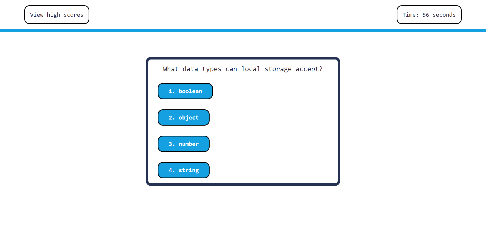

# Web APIs: Code Quiz
 
## Description
 
This project is a single webpage that consists of a timed coding quiz with multiple choice questions.

The motivation behind creating this project is to help users become more proficient coders. This quiz can allow users to measure their understanding of JavaScript. A user can record their scores and compare their results to previous attempts. Users have the ability to also record their initials and compare it to others that attempt the quiz on the same device.

## Usage
 
The website is live on the open web and can be accessed at https://abdallajama201.github.io/Web-APIs/

Users can begin the quiz by pressing the start button. This will start the timer and present the first question. A user can select from four options. When an option is selected the next question is presented. The user is also shown if the previous answer is correct or incorrect underneath the question. If the previous question was answered incorrectly ten seconds is reduced from the time remaining. After the last question or when the timer hits zero the user is presented with their score and an opportunity to record their initials and final score.
 
A photo of the mockup is available below.
 

## License
 
 This project is under the MIT License with language provided by the Open Source Initiative.
